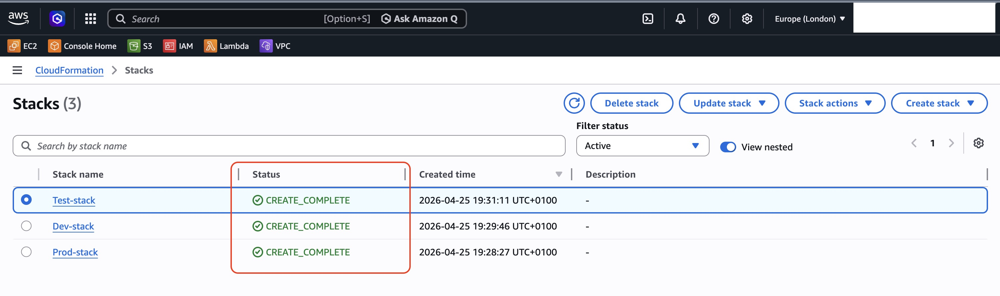
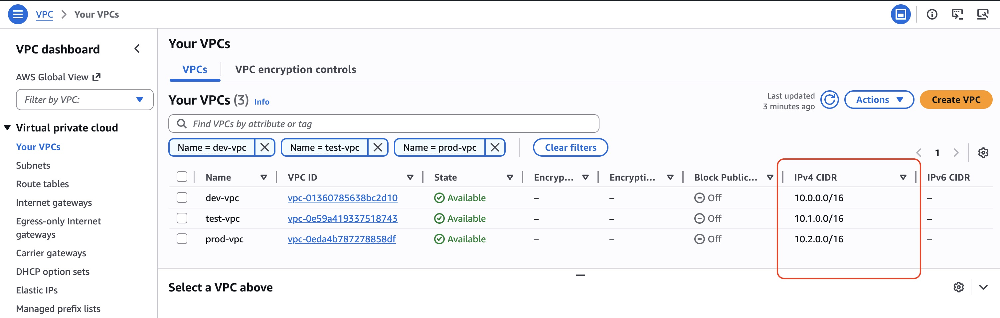
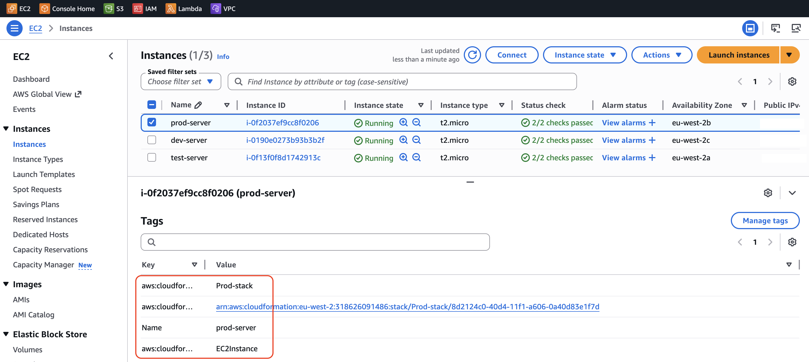
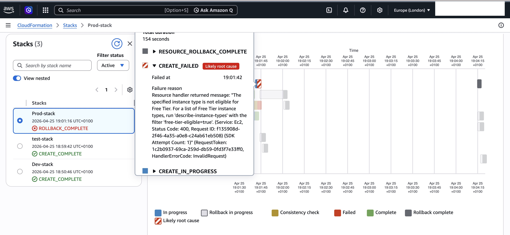

# AWS Multi-Environment Infrastructure as Code (CloudFormation)

## :clipboard: Project Overview
This project demonstrates the deployment of a scalable, multi-tier AWS infrastructure using **CloudFormation**. I designed a single, reusable YAML template capable of provisioning isolated environments for **Development, Testing, and Production** with a single click.

## :building_construction: Key Features

**Dynamic Infrastructure:** Utilised CloudFormation **Parameters** and **Intrinsic Functions** (`!If`, `!Sub`, `!Ref`) to customise resources per environment.
**Network Isolation:** Each environment is deployed into a dedicated VPC with non-overlapping CIDR blocks to ensure security and prevent routing conflicts.
**Resource Standardisation:** Implemented a strict tagging and naming convention (`${EnvironmentName}-server`) to ensure infrastructure is audit-ready and organised.

## :hammer_and_wrench: Tech Stack

**IaC:** AWS CloudFormation (YAML)
**Compute:** AWS EC2 (t2.micro)
**Networking:** AWS VPC, Subnets, Internet Gateways, Route Tables
**Security:** AWS Security Groups (SSH & HTTP access)

## :camera_with_flash: Technical Evidence

### 1. Orchestration Dashboard
Proof of the reusable template successfully deploying three independent stacks.

### 2. Network Segmentation
Evidence of conditional logic applied to networking, ensuring isolated IP spaces for each environment.

### 3. Resource Tagging & Metadata
Demonstrating that the logic correctly assigned environment-specific tags to the resources.

---

## :warning: Incident Log: Troubleshooting & Governance
During the initial deployment of the **Production** stack, the creation failed with an `INVALID_REQUEST` error.

**Issue:** The template was originally configured to request a `t2.small` instance for Production. However, the AWS account was restricted to **Free Tier eligible** types only.

**Resolution:** 

**Analysis:** Analysed the CloudFormation event logs to identify the "Likely root cause."
**Cleanup:** Deleted the failed stack to clear the resource state.
**Refactoring:** Updated the YAML logic to standardise on `t2.micro` while maintaining the advanced networking logic.
**Validation:** Successfully redeployed, proving the ability to debug and iterate on IaC templates.

